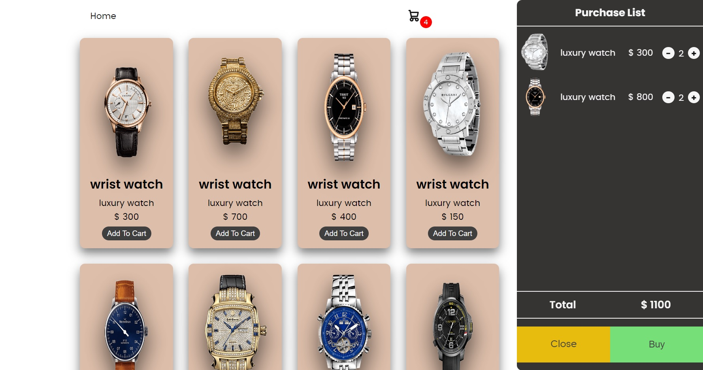

# Online Shopping App Single Page

This application is an online shopping app that allows users to view a list of luxury watches and add them to their cart. The program is built using HTML, CSS, and JavaScript and utilizes browser features.

## Features
- **Display Items**: The app displays a list of luxury watches with their images, names, and prices.
- **Add to Cart**: Users can add items to their cart by clicking the "Add to Cart" button.
- **View Cart**: Users can view their cart by clicking the shopping cart icon, where they can see the items they've added, adjust quantities, and view the total price.
- **Scroll Pagination**: The app uses scroll pagination to load more items as the user scrolls down the page.

## Usage Guide
1. **Display Items**:
    - Upon loading the page, the app displays a list of luxury watches.
    - Users can scroll down to view more items, and new items will be loaded automatically as they scroll.

2. **Add to Cart**:
    - To add an item to the cart, click the "Add to Cart" button below the item.

3. **View Cart**:
    - To view the cart, click the shopping cart icon in the top right corner of the page.
    - In the cart, users can see the items they've added, adjust quantities using the "+" and "-" buttons, and view the total price.
    

---

### Clone

- Clone the repository:
   ```bash
   https://github.com/amin93k/Shopping-Cart.git
